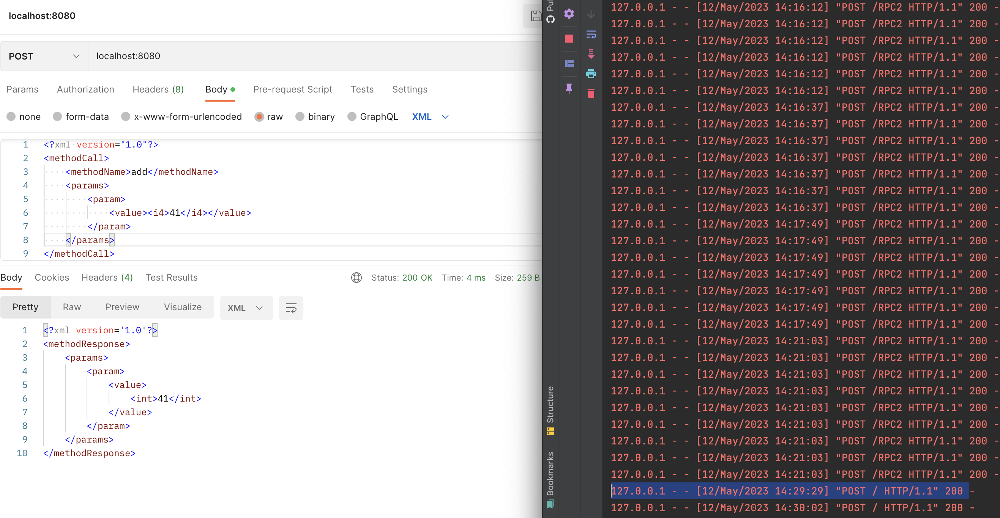
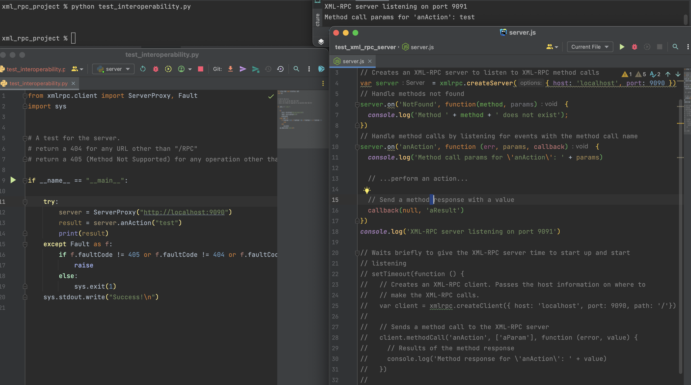

# INFO314-XMLRPC
A homework assignment for my INFO314 course.

### Prerequisites
- Make sure Python 3 has **xmlrpc** (standard library).

### Resources Used
- [Krystian Safjan's Blog Post](https://safjan.com/how-to-use-rpc-in-python/)
- [W3schools Python assert Keyword](https://www.w3schools.com/python/ref_keyword_assert.asp)
- [TutorialsPoint Python XMLRPC Server](https://www.tutorialspoint.com/xmlrpc-server-and-client-modules-in-python)
- [Transport item in XMLRPC](https://stackoverflow.com/a/25287787/5015219)

## Instructions
~~First set up a virtual environment and install the requirements.~~
```shell
python3 -m venv venv
source venv/bin/activate
pip install -r requirements.txt
```

> **Note: The rest of the commands must be run inside the virtual environment.**

To run the basic assignment, change directories to **engine/xml_rpc_project** and then run the server.
```shell
cd engine/xml_rpc_project
python server.py
```

Then, in a separate terminal, run the client.
```shell
cd engine/xml_rpc_project
python client.py localhost 8080
```


Test to verify server requirements.
```shell
cd engine/xml_rpc_project
python test.py
```

## Notes
- I handle `If anything than an i4 is passed to any of these endpoints, return a faultCode of 3 and a faultString of "illegal argument type".` with handling Exceptions and returning a faultCode of 3 and a faultString of "illegal argument type".
- The server prints out **Running server on localhost:8080** when it is running, as per the assignment specs to display the hostname.
- There is not a maximum integer size for Python, so I simulated this with `sys.maxsize`.
- I added the **User Agent** to the client through the **xmlrpc.client Transport** item.

## Interoperability
> I decided to test interoperability by myself because I was worried about academic integrity and I didn't want to see source of other students, and I didn't want to share mine. 

I tested the interoperability of my **Python XMLRPC server** with Postman.

This simulated an interoperable client to my server.

I tested the interoperability of the **client** by creating a file, **test_interoperability.py** on a Node.JS version of a server I made.
It was pretty easy with [this package](https://www.npmjs.com/package/xmlrpc).



